# adqselect

[](https://opensource.org/licenses/MIT)
[](https://app.circleci.com/pipelines/github/Gethseman/adqselect)
[](https://codecov.io/gh/Gethseman/adqselect)

A lightweight crate that brings to Rust an `nth_element` implementation that leverages Andrei Alexandrescu's __adaptive quickselect__ algorithm. Also available on [crates.io](https://crates.io/crates/adqselect).

## Installation 

Be sure that your `Cargo.toml` looks somewhat like this:
```toml
[dependencies]
adqselect = "0.1.1"
```
## Usage

Bring the crate into scope:

```rust
extern crate adqselect;

use adqselect::nth_element;
```
then  simply call `nth_element` on a vector.

```rust
let mut v = vec![10, 7, 9, 7, 2, 8, 8, 1, 9, 4];
nth_element(&mut v, 3, &mut Ord::cmp);

assert_eq!(v[3], 7);
```

This implementation also handles generic data types as long as they satisfy the `PartialEq` and `PartialOrd` traits.

## Implementation

Link to the [original paper: Fast Deterministic Selection](https://arxiv.org/abs/1606.00484) by Andrei Alexandrescu.

## Performance

The algorithm is based on a refined version of Median of Medians and it guarantees linear deterministic time complexity.

## Benchmarks

Here are some benchmarks against other crates: [floydrivest](https://crates.io/crates/floydrivest), [order-stat](https://crates.io/crates/order-stat), [kth](https://crates.io/crates/kth) and [pdqselect](https://crates.io/crates/pdqselect).

<details><summary>Results</summary>
<p>

<h3>Violin Plot</h3>
        <a href="violin.svg">
            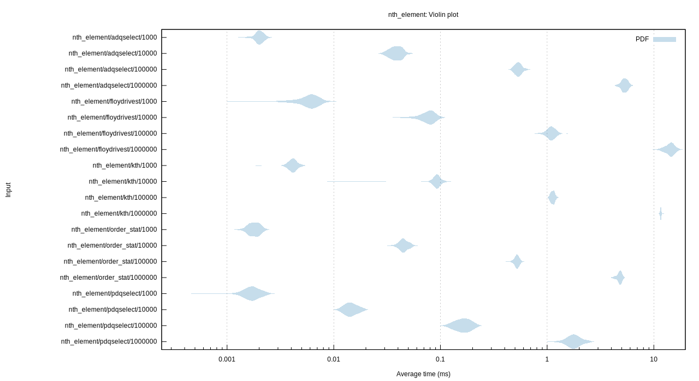
        </a>
        <p>This chart shows the relationship between function/parameter and iteration time. The thickness of the shaded
            region indicates the probability that a measurement of the given function/parameter would take a particular
            length of time.</p>
        <h3>Line Chart</h3>
        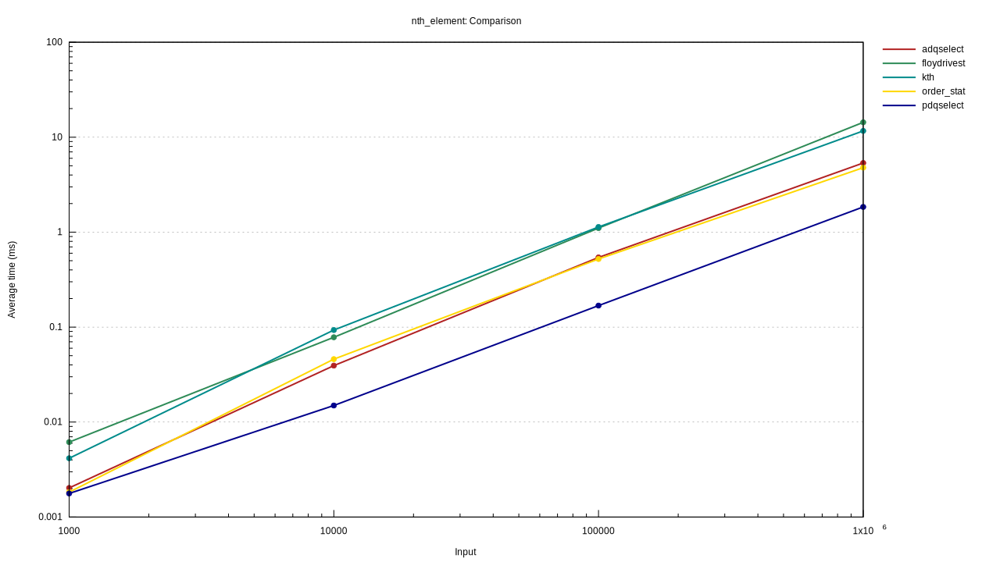
        <p>This chart shows the mean measured time for each function as the input (or the size of the input) increases.
        </p>
        <section class="plots">
            <h4> adqselect on 1.000 random unsigned integers </h4>
            <table width="100%">
                <tbody>
                    <tr>
                        <td>
                            <a href="./imgs/nth_element/adqselect/1000/report/pdf.svg">
                                
                            </a>
                        </td>
                        <td>
                            <a href="./imgs/nth_element/adqselect/1000/report/regression.svg">
                                
                            </a>
                        </td>
                    </tr>
                </tbody>
            </table>
        </section>
        <section class="plots">
            <h4>adqselect on 10.000 random unsigned integers</h4>
            <table width="100%">
                <tbody>
                    <tr>
                        <td>
                            <a href="./imgs/nth_element/adqselect/10000/report/pdf.svg">
                                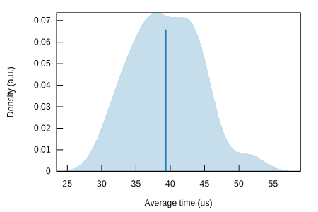
                            </a>
                        </td>
                        <td>
                            <a href="./imgs/nth_element/adqselect/10000/report/regression.svg">
                                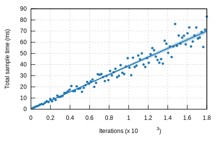
                            </a>
                        </td>
                    </tr>
                </tbody>
            </table>
        </section>
        <section class="plots">
                <h4>adqselect on 100.000 random unsigned integers</h4>
            <table width="100%">
                <tbody>
                    <tr>
                        <td>
                            <a href="./imgs/nth_element/adqselect/100000/report/pdf.svg">
                                
                            </a>
                        </td>
                        <td>
                            <a href="./imgs/nth_element/adqselect/100000/report/regression.svg">
                                
                            </a>
                        </td>
                    </tr>
                </tbody>
            </table>
        </section>
        <section class="plots">
                <h4>adqselect on 1.000.000 random unsigned integers</h4>
            <table width="100%">
                <tbody>
                    <tr>
                        <td>
                            <a href="./imgs/nth_element/adqselect/1000000/report/pdf.svg">
                                
                            </a>
                        </td>
                        <td>
                            <a href="./imgs/nth_element/adqselect/1000000/report/iteration_times.svg">
                                
                            </a>
                        </td>
                    </tr>
                </tbody>
            </table>
        </section>
        <section class="plots">
                <h4>floydrivest on 1.000 random unsigned integers</h4>
            <table width="100%">
                <tbody>
                    <tr>
                        <td>
                            <a href="./imgs/nth_element/floydrivest/1000/report/pdf.svg">
                                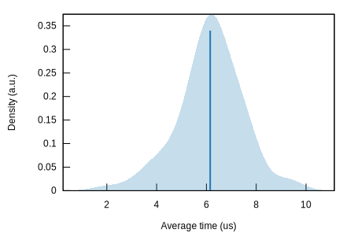
                            </a>
                        </td>
                        <td>
                            <a href="./imgs/nth_element/floydrivest/1000/report/regression.svg">
                                
                            </a>
                        </td>
                    </tr>
                </tbody>
            </table>
        </section>
        <section class="plots">
                <h4>floydrivest on 10.000 random unsigned integers</h4>
            <table width="100%">
                <tbody>
                    <tr>
                        <td>
                            <a href="./imgs/nth_element/floydrivest/10000/report/pdf.svg">
                                
                            </a>
                        </td>
                        <td>
                            <a href="./imgs/nth_element/floydrivest/10000/report/regression.svg">
                                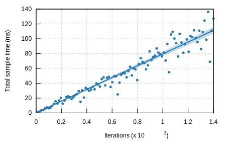
                            </a>
                        </td>
                    </tr>
                </tbody>
            </table>
        </section>
        <section class="plots">
                <h4>floydrivest on 100.000 random unsigned integers</h4>
            <table width="100%">
                <tbody>
                    <tr>
                        <td>
                            <a href="./imgs/nth_element/floydrivest/100000/report/pdf.svg">
                                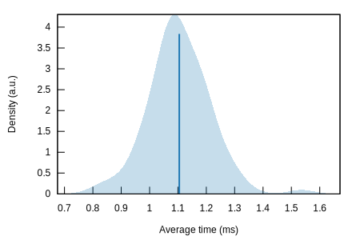
                            </a>
                        </td>
                        <td>
                            <a href="./imgs/nth_element/floydrivest/100000/report/regression.svg">
                                
                            </a>
                        </td>
                    </tr>
                </tbody>
            </table>
        </section>
        <section class="plots">
                <h4>floydrivest on 1.000.000 random unsigned integers</h4>
            <table width="100%">
                <tbody>
                    <tr>
                        <td>
                            <a href="./imgs/nth_element/floydrivest/1000000/report/pdf.svg">
                                
                            </a>
                        </td>
                        <td>
                            <a href="./imgs/nth_element/floydrivest/1000000/report/iteration_times.svg">
                                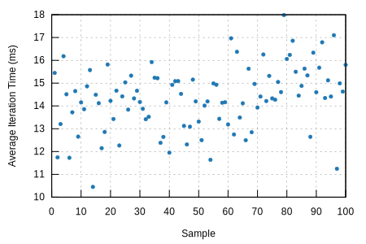
                            </a>
                        </td>
                    </tr>
                </tbody>
            </table>
        </section>
        <section class="plots">
                <h4>kth on 1.000 random unsigned integers</h4>
            <table width="100%">
                <tbody>
                    <tr>
                        <td>
                            <a href="./imgs/nth_element/kth/1000/report/pdf.svg">
                                
                            </a>
                        </td>
                        <td>
                            <a href="./imgs/nth_element/kth/1000/report/regression.svg">
                                
                            </a>
                        </td>
                    </tr>
                </tbody>
            </table>
        </section>
        <section class="plots">
                <h4>kth on 10.000 random unsigned integers</h4>
            <table width="100%">
                <tbody>
                    <tr>
                        <td>
                            <a href="./imgs/nth_element/kth/10000/report/pdf.svg">
                                
                            </a>
                        </td>
                        <td>
                            <a href="./imgs/nth_element/kth/10000/report/regression.svg">
                                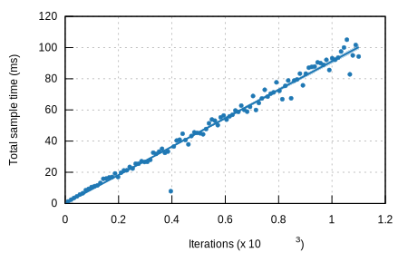
                            </a>
                        </td>
                    </tr>
                </tbody>
            </table>
        </section>
        <section class="plots">
                <h4>kth on 100.000 random unsigned integers</h4>
            <table width="100%">
                <tbody>
                    <tr>
                        <td>
                            <a href="./imgs/nth_element/kth/100000/report/pdf.svg">
                                
                            </a>
                        </td>
                        <td>
                            <a href="./imgs/nth_element/kth/100000/report/regression.svg">
                                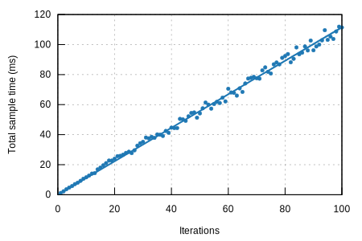
                            </a>
                        </td>
                    </tr>
                </tbody>
            </table>
        </section>
        <section class="plots">
                <h4>kth on 1.000.000 random unsigned integers</h4>
            <table width="100%">
                <tbody>
                    <tr>
                        <td>
                            <a href="./imgs/nth_element/kth/1000000/report/pdf.svg">
                                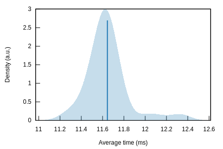
                            </a>
                        </td>
                        <td>
                            <a href="./imgs/nth_element/kth/1000000/report/iteration_times.svg">
                                
                            </a>
                        </td>
                    </tr>
                </tbody>
            </table>
        </section>
        <section class="plots">
                <h4>order_stat on 1.000 random unsigned integers</h4>
            <table width="100%">
                <tbody>
                    <tr>
                        <td>
                            <a href="./imgs/nth_element/order_stat/1000/report/pdf.svg">
                                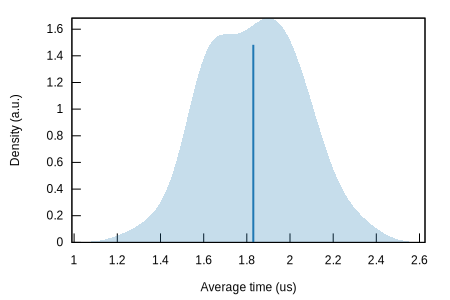
                            </a>
                        </td>
                        <td>
                            <a href="./imgs/nth_element/order_stat/1000/report/regression.svg">
                                
                            </a>
                        </td>
                    </tr>
                </tbody>
            </table>
        </section>
        <section class="plots">
                <h4>order_stat on 10.000 random unsigned integers</h4>
            <table width="100%">
                <tbody>
                    <tr>
                        <td>
                            <a href="./imgs/nth_element/order_stat/10000/report/pdf.svg">
                                
                            </a>
                        </td>
                        <td>
                            <a href="./imgs/nth_element/order_stat/10000/report/regression.svg">
                                
                            </a>
                        </td>
                    </tr>
                </tbody>
            </table>
        </section>
        <section class="plots">
                <h4>order_stat on 100.000 random unsigned integers</h4>
            <table width="100%">
                <tbody>
                    <tr>
                        <td>
                            <a href="./imgs/nth_element/order_stat/100000/report/pdf.svg">
                                
                            </a>
                        </td>
                        <td>
                            <a href="./imgs/nth_element/order_stat/100000/report/regression.svg">
                                
                            </a>
                        </td>
                    </tr>
                </tbody>
            </table>
        </section>
        <section class="plots">
                <h4>order_stat on 1.000.000 random unsigned integers</h4>
            <table width="100%">
                <tbody>
                    <tr>
                        <td>
                            <a href="./imgs/nth_element/order_stat/1000000/report/pdf.svg">
                                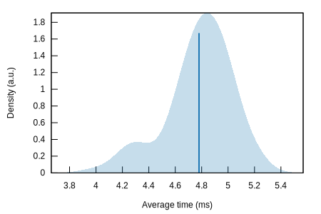
                            </a>
                        </td>
                        <td>
                            <a href="./imgs/nth_element/order_stat/1000000/report/iteration_times.svg">
                                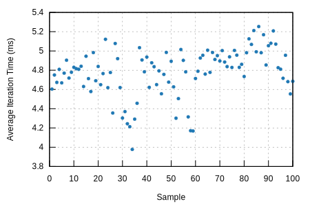
                            </a>
                        </td>
                    </tr>
                </tbody>
            </table>
        </section>
        <section class="plots">
                <h4>pdqselect on 1.000 random unsigned integers</h4>
            <table width="100%">
                <tbody>
                    <tr>
                        <td>
                            <a href="./imgs/nth_element/pdqselect/1000/report/pdf.svg">
                                
                            </a>
                        </td>
                        <td>
                            <a href="./imgs/nth_element/pdqselect/1000/report/regression.svg">
                                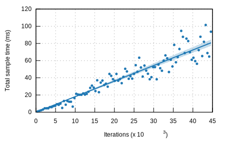
                            </a>
                        </td>
                    </tr>
                </tbody>
            </table>
        </section>
        <section class="plots">
                <h4>pdqselect on 10.000 random unsigned integers</h4>
            <table width="100%">
                <tbody>
                    <tr>
                        <td>
                            <a href="./imgs/nth_element/pdqselect/10000/report/pdf.svg">
                                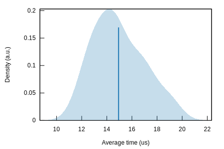
                            </a>
                        </td>
                        <td>
                            <a href="./imgs/nth_element/pdqselect/10000/report/regression.svg">
                                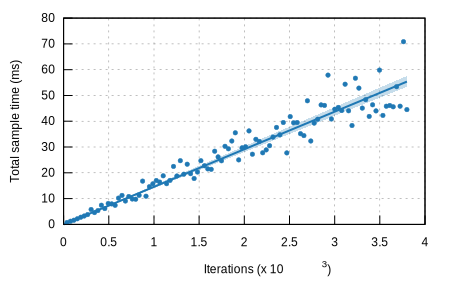
                            </a>
                        </td>
                    </tr>
                </tbody>
            </table>
        </section>
        <section class="plots">
                <h4>pdqselect on 100.000 random unsigned integers</h4>
            <table width="100%">
                <tbody>
                    <tr>
                        <td>
                            <a href="./imgs/nth_element/pdqselect/100000/report/pdf.svg">
                                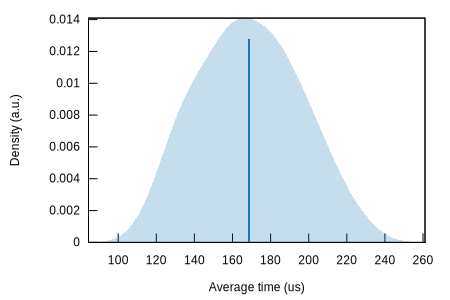
                            </a>
                        </td>
                        <td>
                            <a href="./imgs/nth_element/pdqselect/100000/report/regression.svg">
                                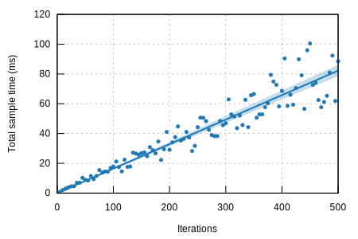
                            </a>
                        </td>
                    </tr>
                </tbody>
            </table>
        </section>
        <section class="plots">
                <h4>pdqselect on 1.000.000 random unsigned integers</h4>
            <table width="100%">
                <tbody>
                    <tr>
                        <td>
                            <a href="./imgs/nth_element/pdqselect/1000000/report/pdf.svg">
                                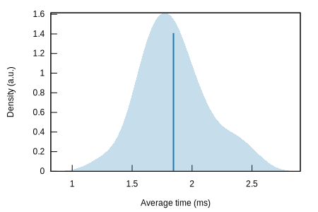
                            </a>
                        </td>
                        <td>
                            <a href="./imgs/nth_element/pdqselect/1000000/report/iteration_times.svg">
                                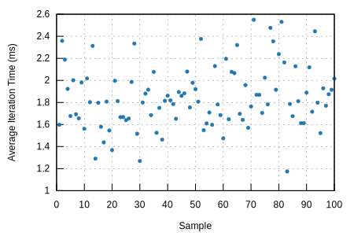
                            </a>
                        </td>
                    </tr>
                </tbody>
            </table>
        </section>
    </div>
    <div id="footer">
        <p>This report was generated by
            <a href="https://github.com/bheisler/criterion.rs">Criterion.rs</a>, a statistics-driven benchmarking
            library in Rust.</p>
    </div>
