<div align="center">

# adqselect

[](https://opensource.org/licenses/MIT)  
[](https://app.circleci.com/pipelines/github/frjnn/adqselect)  
[](https://codecov.io/gh/frjnn/adqselect)

</div>

A lightweight, zero-dependency crate that provides an efficient `nth_element` implementation in Rust — based on Andrei Alexandrescu’s *Adaptive Quickselect* algorithm.  
Available on [crates.io](https://crates.io/crates/adqselect).

---

## ✨ Features
- Deterministic linear-time selection (no random pivots)
- Handles any data type implementing `PartialOrd`
- Minimal and dependency-free
- Well-tested and benchmarked

---

## 📦 Installation

Add the crate to your `Cargo.toml`:

```toml
[dependencies]
adqselect = "0.1.4"
```

---

## 🚀 Usage

```rust
use adqselect::nth_element;

fn main() {
    let mut v = vec![10, 7, 9, 7, 2, 8, 8, 1, 9, 4];
    nth_element(&mut v, 3, &mut Ord::cmp);

    assert_eq!(v[3], 7);
}
```

`nth_element` rearranges the vector so that the element at position `n` is the same as if the vector were fully sorted — but runs in **O(n)** time on average.

The elements before index `n` are less than or equal to `v[n]`, and those after are greater than or equal.

---

## 🧩 Implementation

Based on the paper  
> [**Fast Deterministic Selection** (Andrei Alexandrescu, 2016)](https://arxiv.org/abs/1606.00484)

This algorithm refines the classic *Median of Medians* approach to achieve strong performance guarantees while remaining practical.

---

## ⚡ Performance

`adqselect` guarantees linear deterministic time complexity and is competitive with popular selection crates such as:
- [`floydrivest`](https://crates.io/crates/floydrivest)
- [`order-stat`](https://crates.io/crates/order-stat)
- [`kth`](https://crates.io/crates/kth)
- [`pdqselect`](https://crates.io/crates/pdqselect)

---

## 🧪 Benchmarks

Detailed benchmarks are available in the repository, comparing throughput and allocation efficiency across datasets of varying size and distribution.

---

## 📄 License

Licensed under the [MIT License](https://opensource.org/licenses/MIT).


<details><summary>Results</summary>
<p>

<h3>Violin Plot</h3>
        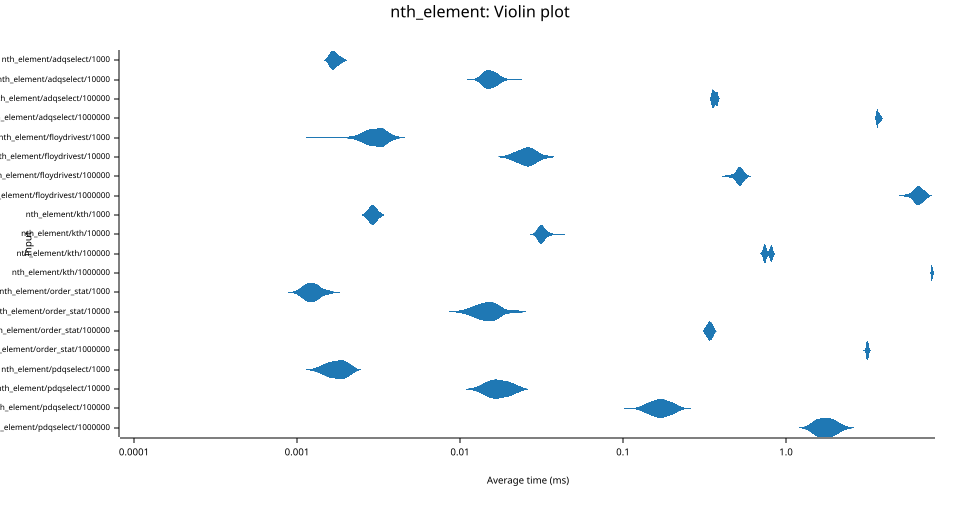
        <p>This chart shows the relationship between function/parameter and iteration time. The thickness of the shaded
            region indicates the probability that a measurement of the given function/parameter would take a particular
            length of time.</p>
        <h3>Line Chart</h3>
        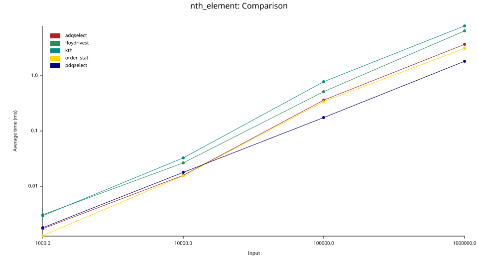
        <p>This chart shows the mean measured time for each function as the input (or the size of the input) increases.
        </p>
        <section class="plots">
            <h4> adqselect on 1.000 random unsigned integers </h4>
            <table width="100%">
                <tbody>
                    <tr>
                        <td>
                            <a href="./imgs/nth_element/adqselect/1000/report/pdf.svg">
                                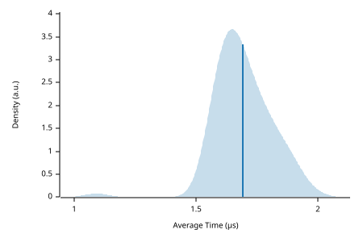
                            </a>
                        </td>
                        <td>
                            <a href="./imgs/nth_element/adqselect/1000/report/regression.svg">
                                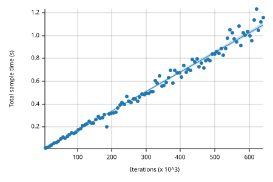
                            </a>
                        </td>
                    </tr>
                </tbody>
            </table>
        </section>
        <section class="plots">
            <h4>adqselect on 10.000 random unsigned integers</h4>
            <table width="100%">
                <tbody>
                    <tr>
                        <td>
                            <a href="./imgs/nth_element/adqselect/10000/report/pdf.svg">
                                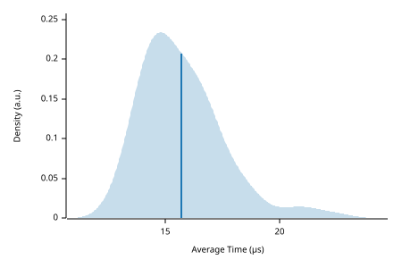
                            </a>
                        </td>
                        <td>
                            <a href="./imgs/nth_element/adqselect/10000/report/regression.svg">
                                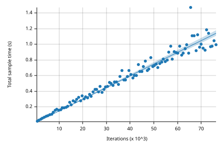
                            </a>
                        </td>
                    </tr>
                </tbody>
            </table>
        </section>
        <section class="plots">
                <h4>adqselect on 100.000 random unsigned integers</h4>
            <table width="100%">
                <tbody>
                    <tr>
                        <td>
                            <a href="./imgs/nth_element/adqselect/100000/report/pdf.svg">
                                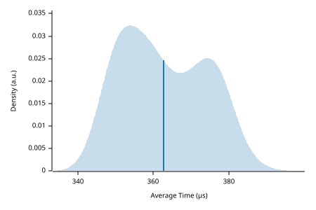
                            </a>
                        </td>
                        <td>
                            <a href="./imgs/nth_element/adqselect/100000/report/regression.svg">
                                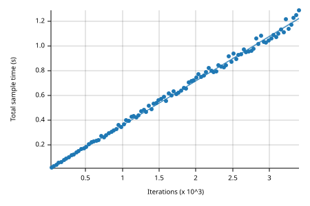
                            </a>
                        </td>
                    </tr>
                </tbody>
            </table>
        </section>
        <section class="plots">
                <h4>adqselect on 1.000.000 random unsigned integers</h4>
            <table width="100%">
                <tbody>
                    <tr>
                        <td>
                            <a href="./imgs/nth_element/adqselect/1000000/report/pdf.svg">
                                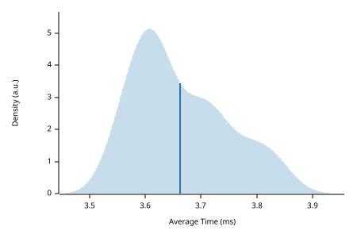
                            </a>
                        </td>
                        <td>
                            <a href="./imgs/nth_element/adqselect/1000000/report/iteration_times.svg">
                                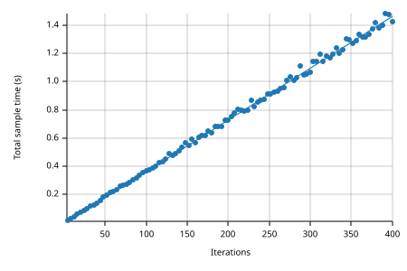
                            </a>
                        </td>
                    </tr>
                </tbody>
            </table>
        </section>
        <section class="plots">
                <h4>floydrivest on 1.000 random unsigned integers</h4>
            <table width="100%">
                <tbody>
                    <tr>
                        <td>
                            <a href="./imgs/nth_element/floydrivest/1000/report/pdf.svg">
                                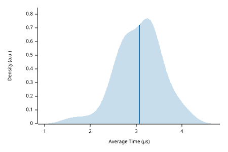
                            </a>
                        </td>
                        <td>
                            <a href="./imgs/nth_element/floydrivest/1000/report/regression.svg">
                                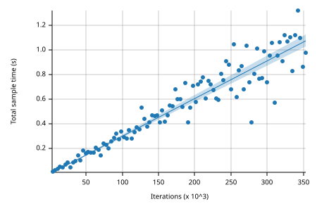
                            </a>
                        </td>
                    </tr>
                </tbody>
            </table>
        </section>
        <section class="plots">
                <h4>floydrivest on 10.000 random unsigned integers</h4>
            <table width="100%">
                <tbody>
                    <tr>
                        <td>
                            <a href="./imgs/nth_element/floydrivest/10000/report/pdf.svg">
                                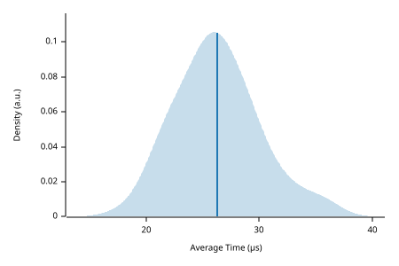
                            </a>
                        </td>
                        <td>
                            <a href="./imgs/nth_element/floydrivest/10000/report/regression.svg">
                                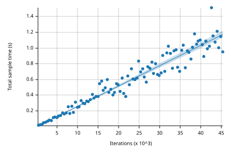
                            </a>
                        </td>
                    </tr>
                </tbody>
            </table>
        </section>
        <section class="plots">
                <h4>floydrivest on 100.000 random unsigned integers</h4>
            <table width="100%">
                <tbody>
                    <tr>
                        <td>
                            <a href="./imgs/nth_element/floydrivest/100000/report/pdf.svg">
                                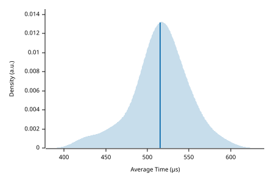
                            </a>
                        </td>
                        <td>
                            <a href="./imgs/nth_element/floydrivest/100000/report/regression.svg">
                                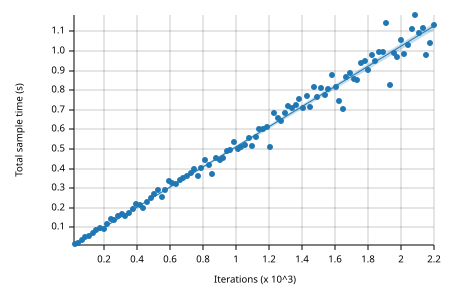
                            </a>
                        </td>
                    </tr>
                </tbody>
            </table>
        </section>
        <section class="plots">
                <h4>floydrivest on 1.000.000 random unsigned integers</h4>
            <table width="100%">
                <tbody>
                    <tr>
                        <td>
                            <a href="./imgs/nth_element/floydrivest/1000000/report/pdf.svg">
                                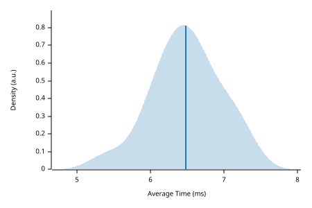
                            </a>
                        </td>
                        <td>
                            <a href="./imgs/nth_element/floydrivest/1000000/report/iteration_times.svg">
                                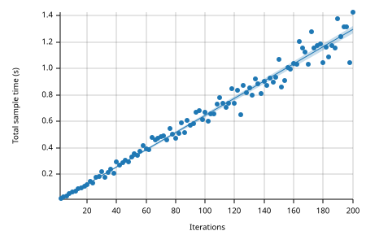
                            </a>
                        </td>
                    </tr>
                </tbody>
            </table>
        </section>
        <section class="plots">
                <h4>kth on 1.000 random unsigned integers</h4>
            <table width="100%">
                <tbody>
                    <tr>
                        <td>
                            <a href="./imgs/nth_element/kth/1000/report/pdf.svg">
                                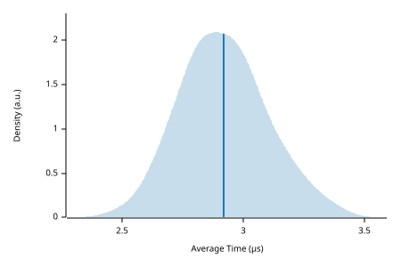
                            </a>
                        </td>
                        <td>
                            <a href="./imgs/nth_element/kth/1000/report/regression.svg">
                                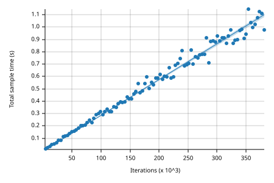
                            </a>
                        </td>
                    </tr>
                </tbody>
            </table>
        </section>
        <section class="plots">
                <h4>kth on 10.000 random unsigned integers</h4>
            <table width="100%">
                <tbody>
                    <tr>
                        <td>
                            <a href="./imgs/nth_element/kth/10000/report/pdf.svg">
                                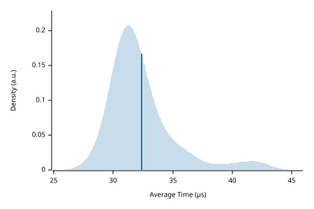
                            </a>
                        </td>
                        <td>
                            <a href="./imgs/nth_element/kth/10000/report/regression.svg">
                                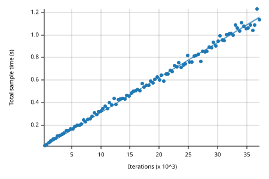
                            </a>
                        </td>
                    </tr>
                </tbody>
            </table>
        </section>
        <section class="plots">
                <h4>kth on 100.000 random unsigned integers</h4>
            <table width="100%">
                <tbody>
                    <tr>
                        <td>
                            <a href="./imgs/nth_element/kth/100000/report/pdf.svg">
                                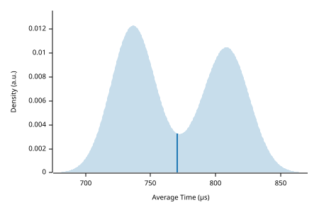
                            </a>
                        </td>
                        <td>
                            <a href="./imgs/nth_element/kth/100000/report/regression.svg">
                                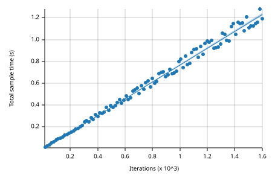
                            </a>
                        </td>
                    </tr>
                </tbody>
            </table>
        </section>
        <section class="plots">
                <h4>kth on 1.000.000 random unsigned integers</h4>
            <table width="100%">
                <tbody>
                    <tr>
                        <td>
                            <a href="./imgs/nth_element/kth/1000000/report/pdf.svg">
                                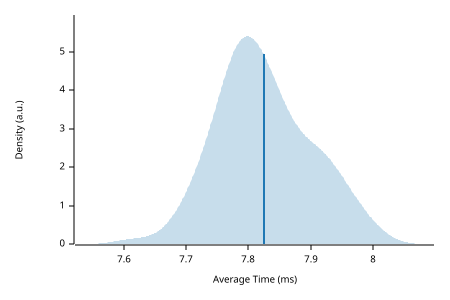
                            </a>
                        </td>
                        <td>
                            <a href="./imgs/nth_element/kth/1000000/report/iteration_times.svg">
                                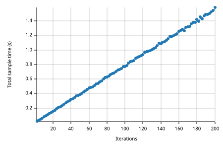
                            </a>
                        </td>
                    </tr>
                </tbody>
            </table>
        </section>
        <section class="plots">
                <h4>order_stat on 1.000 random unsigned integers</h4>
            <table width="100%">
                <tbody>
                    <tr>
                        <td>
                            <a href="./imgs/nth_element/order_stat/1000/report/pdf.svg">
                                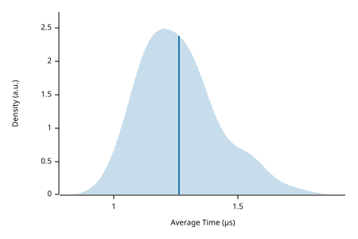
                            </a>
                        </td>
                        <td>
                            <a href="./imgs/nth_element/order_stat/1000/report/regression.svg">
                                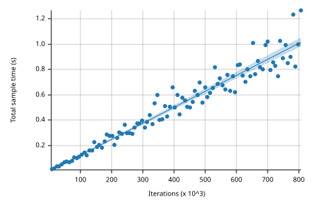
                            </a>
                        </td>
                    </tr>
                </tbody>
            </table>
        </section>
        <section class="plots">
                <h4>order_stat on 10.000 random unsigned integers</h4>
            <table width="100%">
                <tbody>
                    <tr>
                        <td>
                            <a href="./imgs/nth_element/order_stat/10000/report/pdf.svg">
                                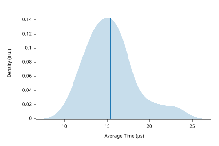
                            </a>
                        </td>
                        <td>
                            <a href="./imgs/nth_element/order_stat/10000/report/regression.svg">
                                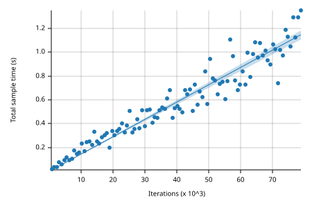
                            </a>
                        </td>
                    </tr>
                </tbody>
            </table>
        </section>
        <section class="plots">
                <h4>order_stat on 100.000 random unsigned integers</h4>
            <table width="100%">
                <tbody>
                    <tr>
                        <td>
                            <a href="./imgs/nth_element/order_stat/100000/report/pdf.svg">
                                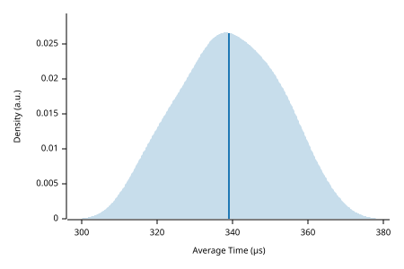
                            </a>
                        </td>
                        <td>
                            <a href="./imgs/nth_element/order_stat/100000/report/regression.svg">
                                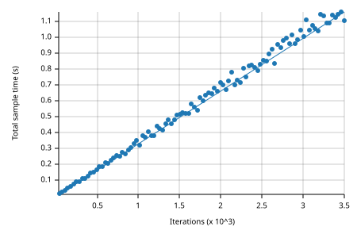
                            </a>
                        </td>
                    </tr>
                </tbody>
            </table>
        </section>
        <section class="plots">
                <h4>order_stat on 1.000.000 random unsigned integers</h4>
            <table width="100%">
                <tbody>
                    <tr>
                        <td>
                            <a href="./imgs/nth_element/order_stat/1000000/report/pdf.svg">
                                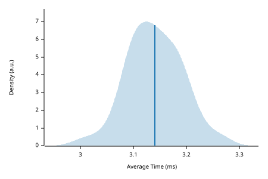
                            </a>
                        </td>
                        <td>
                            <a href="./imgs/nth_element/order_stat/1000000/report/iteration_times.svg">
                                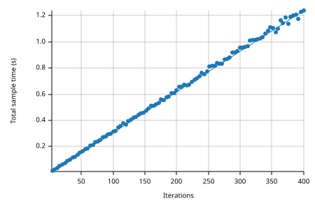
                            </a>
                        </td>
                    </tr>
                </tbody>
            </table>
        </section>
        <section class="plots">
                <h4>pdqselect on 1.000 random unsigned integers</h4>
            <table width="100%">
                <tbody>
                    <tr>
                        <td>
                            <a href="./imgs/nth_element/pdqselect/1000/report/pdf.svg">
                                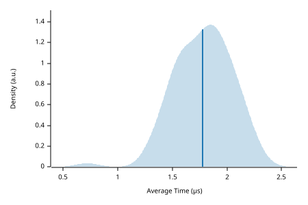
                            </a>
                        </td>
                        <td>
                            <a href="./imgs/nth_element/pdqselect/1000/report/regression.svg">
                                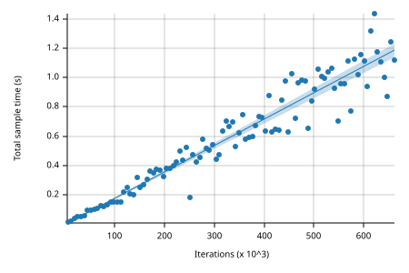
                            </a>
                        </td>
                    </tr>
                </tbody>
            </table>
        </section>
        <section class="plots">
                <h4>pdqselect on 10.000 random unsigned integers</h4>
            <table width="100%">
                <tbody>
                    <tr>
                        <td>
                            <a href="./imgs/nth_element/pdqselect/10000/report/pdf.svg">
                                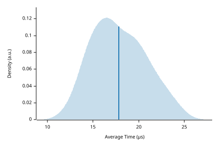
                            </a>
                        </td>
                        <td>
                            <a href="./imgs/nth_element/pdqselect/10000/report/regression.svg">
                                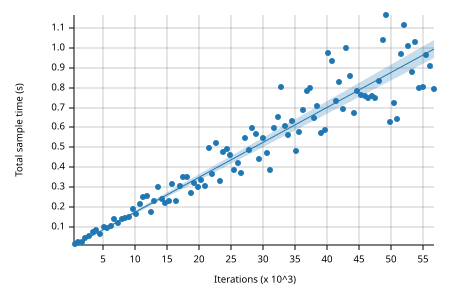
                            </a>
                        </td>
                    </tr>
                </tbody>
            </table>
        </section>
        <section class="plots">
                <h4>pdqselect on 100.000 random unsigned integers</h4>
            <table width="100%">
                <tbody>
                    <tr>
                        <td>
                            <a href="./imgs/nth_element/pdqselect/100000/report/pdf.svg">
                                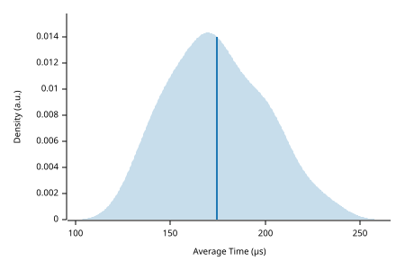
                            </a>
                        </td>
                        <td>
                            <a href="./imgs/nth_element/pdqselect/100000/report/regression.svg">
                                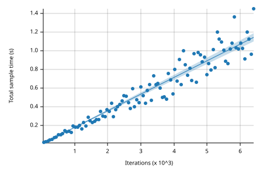
                            </a>
                        </td>
                    </tr>
                </tbody>
            </table>
        </section>
        <section class="plots">
                <h4>pdqselect on 1.000.000 random unsigned integers</h4>
            <table width="100%">
                <tbody>
                    <tr>
                        <td>
                            <a href="./imgs/nth_element/pdqselect/1000000/report/pdf.svg">
                                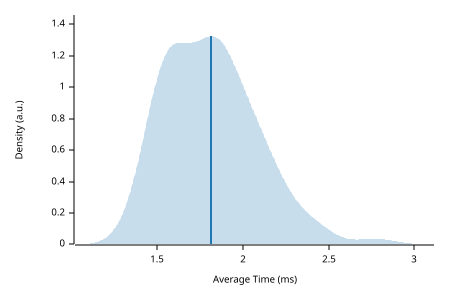
                            </a>
                        </td>
                        <td>
                            <a href="./imgs/nth_element/pdqselect/1000000/report/iteration_times.svg">
                                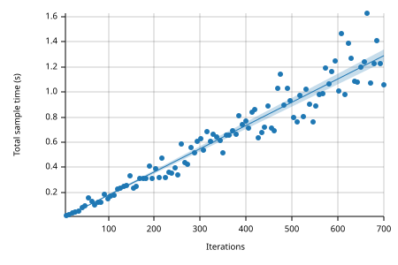
                            </a>
                        </td>
                    </tr>
                </tbody>
            </table>
        </section>
    </div>
    <div id="footer">
        <p>This report was generated by
            <a href="https://github.com/bheisler/criterion.rs">Criterion.rs</a>, a statistics-driven benchmarking
            library in Rust.</p>
    </div>
